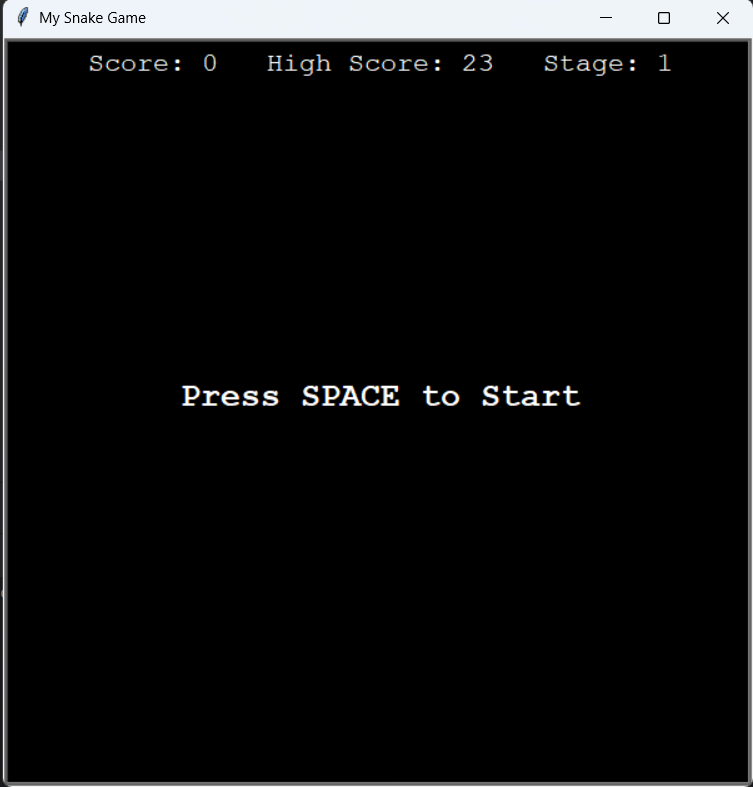
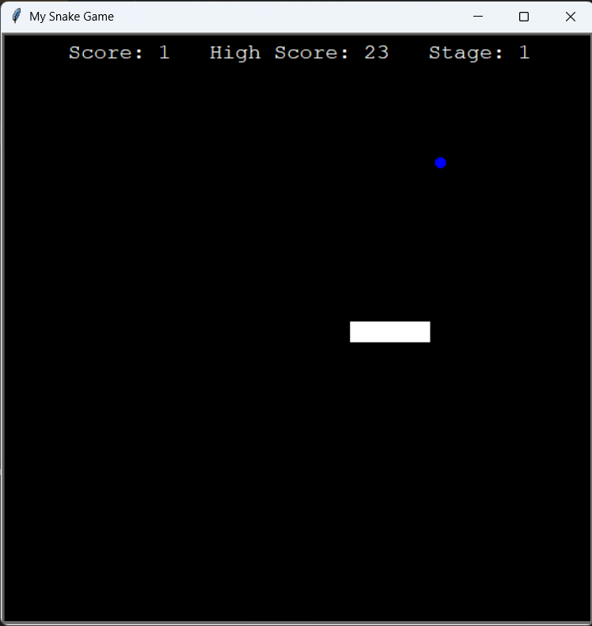
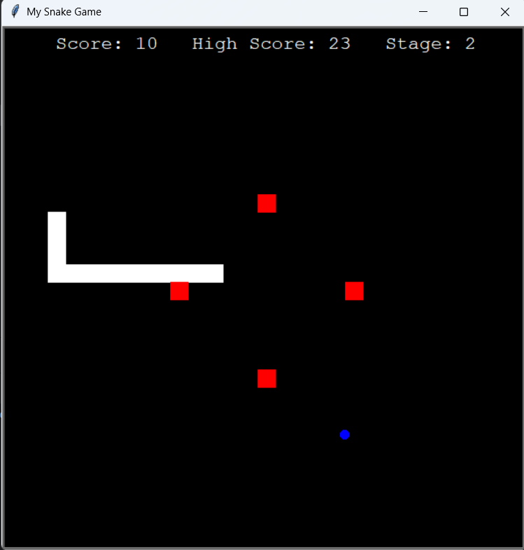
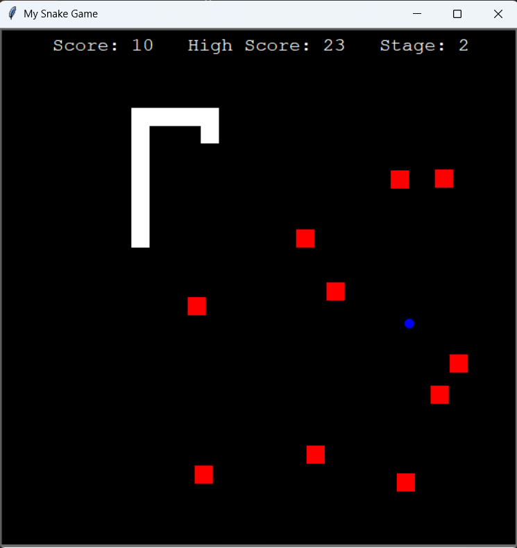
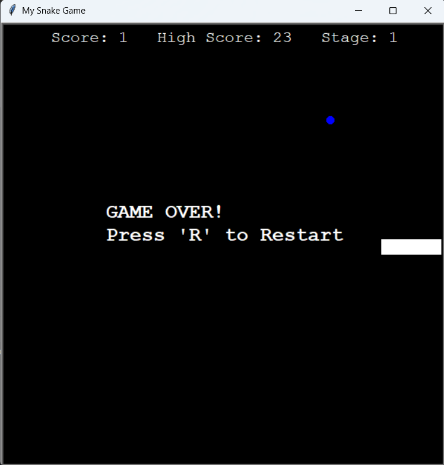

# 🐍 Snake Game with Stages 🎮

This is a Python-based Snake Game built using the `turtle` graphics module. It extends the classic Snake gameplay by introducing **multiple stages** with increasing difficulty, a **high score tracker**, and smooth restart functionality.

## 🚀 Features
- **Classic Snake Mechanics**: Eat food, grow longer, and avoid collisions with walls or yourself.
- **Stage System**:
  - **Stage 1**: Normal snake gameplay with no obstacles.
  - **Stage 2**: Unlocks when the score reaches 10, introducing static walls as obstacles.
  - **Stage 3**: Unlocks at score 25, where dynamic/random walls appear, increasing difficulty step by step, similar to the Chrome Dino game.
- **High Score Tracking**: Your highest score is saved and displayed even after restarting.
- **Game Over + Restart**: On hitting a wall or yourself, "GAME OVER" is displayed, and you can restart the game by pressing a key.
- **Press Space to Start**: The game begins when you hit the space bar, giving you control over when to start playing.
- **Clean Object-Oriented Code**: Organized into multiple files (`main.py`, `snake.py`, `food.py`, `scoreboard.py`, `walls.py`) for readability and scalability.

## 🎯 Controls
- **Arrow Keys**: Move the snake (Up, Down, Left, Right)
- **Spacebar**: Start the game
- **R Key**: Restart the game after losing

## 📂 File Structure
- `main.py` → Runs the game loop and manages stages
- `snake.py` → Snake class (movement, growth, reset)
- `food.py` → Food generation logic
- `scoreboard.py` → Score and high score handling
- `walls.py` → Stage-specific wall generation

## 🛠 Requirements
- Python 3.x
- Turtle module (comes pre-installed with Python)

## ▶️ How to Play
1. Clone or download the repository.
2. Run `main.py` in your terminal or IDE.
3. Press **Space** to start.
4. Use the **Arrow Keys** to move your snake.
5. Reach **Score 10** to unlock Stage 2, and **Score 25** to unlock Stage 3.
6. Avoid hitting walls or yourself!
7. Press **R** to restart after losing.

## 🖼️ Screenshots
-  **Start**
  
- **Stage 1**
  
- **Stage 2**
  
- **Stage 3**
  
- **Restart**
  

## 🏆 Objective
Eat as much food as possible, survive through all stages, and try to beat your high score!
